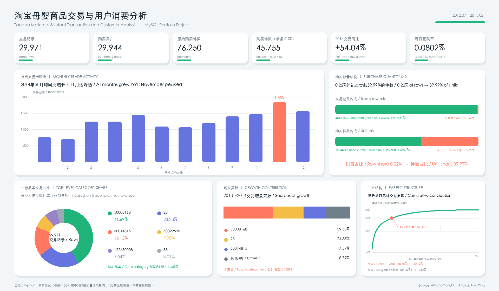

# 淘宝母婴商品交易与用户消费分析

# Taobao Maternal and Infant Transaction & Customer Analysis

## 项目简介 | Overview

本项目基于[阿里云天池母婴购物数据集](https://tianchi.aliyun.com/dataset/45)，
使用 MySQL 分析淘宝母婴商品的销售趋势、品类结构、用户购买频次与复购特征，
并将最终成果整理为 HTML 交互看板、双语分析报告和个人作品网站案例。

This MySQL portfolio project uses the
[Alibaba Tianchi maternal and infant shopping dataset](https://tianchi.aliyun.com/dataset/45)
to analyze sales trends, category structure, purchase frequency, and repeat
purchase. Final deliverables will include an interactive HTML dashboard, bilingual
report, and portfolio website case study.

> **状态 / Status:** 数据模型完成，进入业务分析 / Analytical model complete; business analysis in progress



*静态 BI 看板总览 / Static BI dashboard overview*

## 数据 | Data

| 数据表 Table | 数据量 Rows | 主要字段 Key fields |
|---|---:|---|
| 婴儿信息 / Baby information | 953 | `user_id`, `birthday`, `gender` |
| 交易历史 / Trade history | 29,971 | `user_id`, `auction_id`, `cat_id`, `cat1`, `property`, `buy_mount`, `day` |

原始 CSV 不上传 GitHub。两张表通过 `user_id` 关联，但婴儿信息仅覆盖 3.18% 的
交易用户，因此年龄与性别分析只作为补充探索，不能推广到全体用户。

Raw CSV files are excluded from GitHub. The tables join on `user_id`, but baby
information covers only 3.18% of purchasing users; age and gender analysis is
therefore supplementary and not generalizable to all users.

## 分析主线 | Analysis framework

1. 整体交易与购买件数 KPI / Overall transaction and unit KPIs
2. 年、季度和月度趋势及增长拆解 / Time trends and growth decomposition
3. 一级与细分类目结构 / Top-level and detailed category performance
4. 全量用户购买频次、跨日复购与分层 / Purchase frequency, repeat purchase, and segmentation
5. 高购买数量对 KPI 的敏感性 / Sensitivity to high-quantity purchases
6. 匹配子样本的年龄与性别补充分析 / Supplementary age and gender analysis

详细业务背景、指标口径、分析步骤和限制见
[项目分析框架](docs/01_project_overview.md)。

See the [project analysis framework](docs/01_project_overview.md) for the
business context, metric definitions, analytical steps, and limitations.

## 已验证的数据质量发现 | Validated data-quality findings

- 两个 CSV 均与数据库导入行数完全对账；
- 婴儿 `user_id` 非空且唯一；
- 交易表无完全重复行，`auction_id` 不唯一，事实表需使用代理主键；
- 日期字段均可成功转换；
- `property` 缺失 144 行（约 0.48%），不影响核心交易分析；
- 65 条购买数量不低于 100 的记录仅占 0.2169%，却贡献 39.99% 的购买件数；
- 婴儿信息用户覆盖率仅 3.18%。

- Both CSV imports reconcile exactly to source row counts;
- baby `user_id` is non-null and unique;
- trade history has no exact duplicates, while `auction_id` is not unique;
- all date values convert successfully;
- `property` is missing in 144 rows (about 0.48%) without blocking core metrics;
- 65 rows with quantity at least 100 represent 0.2169% of rows but 39.99% of units;
- baby-information user coverage is only 3.18%.

完整验证依据见[数据质量摘要](docs/02_data_quality_summary.md)。

See the [data-quality summary](docs/02_data_quality_summary.md) for evidence and
modeling decisions.

## 当前分析结果 | Current analysis results

- 29,971 条交易记录、29,944 个购买用户、76,250 件；
- 人均交易记录 1.0009，每条记录平均 2.54 件；
- `<100` 件记录平均 1.53 件；
- 65 条高数量记录贡献总件数的 39.99%，因此所有销量结论需要敏感性对照。
- 仅 24 个用户发生跨日复购，复购率为 0.0802%。

- 29,971 trade rows, 29,944 purchasing users, and 76,250 units;
- 1.0009 trade rows per user and 2.54 units per row overall;
- 1.53 units per row below 100 units;
- 65 high-quantity rows contribute 39.99% of units, requiring sensitivity views.
- only 24 users purchase on multiple dates, a cross-day repeat rate of 0.0802%.

详见[分析结果](docs/03_analysis_results.md)。

See [analysis results](docs/03_analysis_results.md).

完整的图文叙事、业务建议、限制与可复现性说明见
[最终分析报告](docs/04_final_analysis_report.md)。

See the [final illustrated analysis report](docs/04_final_analysis_report.md)
for the complete narrative, recommendations, limitations, and reproducibility
map.

后续看板、报告图表和个人作品网站统一遵循
[视觉设计规范](docs/05_visual_design_system.md)。

Future dashboards, report figures, and portfolio pages follow the
[visual design system](docs/05_visual_design_system.md).

## 仓库结构 | Repository structure

```text
├── README.md
├── docs/
│   ├── 01_project_overview.md
│   ├── 02_data_quality_summary.md
│   ├── 03_analysis_results.md
│   ├── 04_final_analysis_report.md
│   └── 05_visual_design_system.md
├── assets/figures/
├── data/
│   └── pareto_category_segments.csv
└── sql/
│   ├── 01_setup.sql
│   ├── 02_model.sql
│   ├── 03_overview_kpis.sql
│   ├── 04_customer_frequency.sql
│   ├── 05_time_trends.sql
│   ├── 06_category_analysis.sql
│   └── 07_demographic_supplement.sql
```

后续只在分析模块完成并验证后添加合并后的成品 SQL、最终报告和看板材料。课堂
练习、草稿和逐步输出保存在仓库外，不进入公开作品集。

Only consolidated, validated SQL and final reporting/dashboard artifacts are
added after each module is complete. Classroom exercises, drafts, and
step-by-step outputs remain outside the public portfolio repository.

## 工具 | Tools

- MySQL 9.7.1
- Navicat
- Python / Pillow（报告图表 / report figures）

## 作者 | Author

Alva Ding
