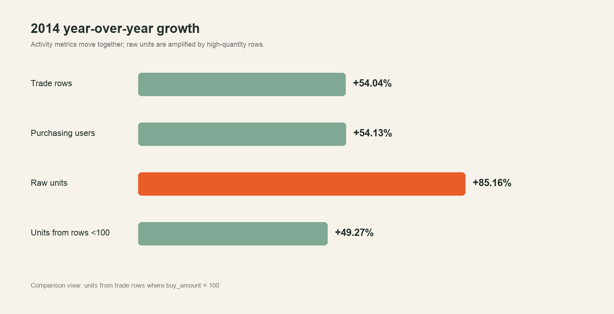
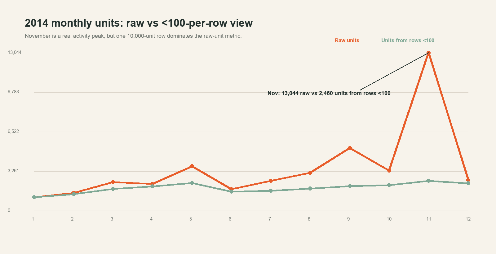
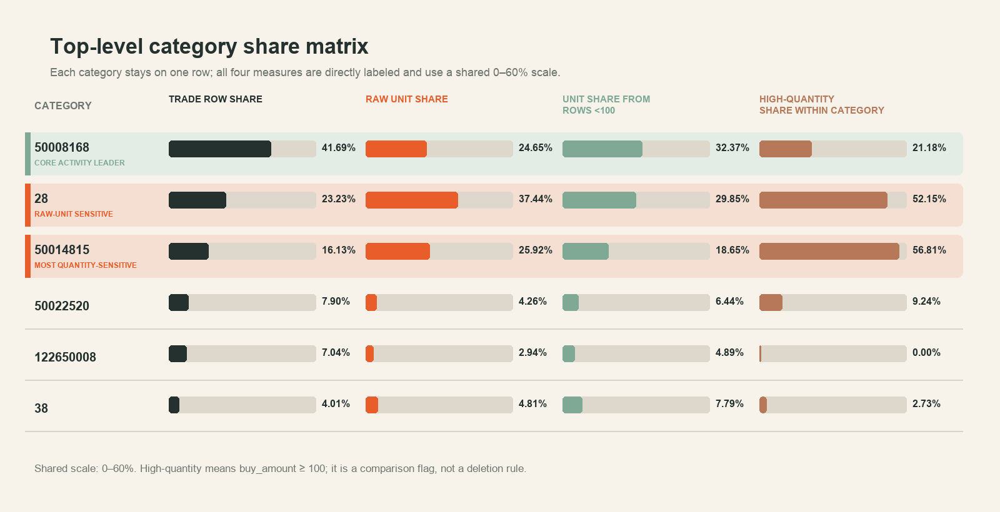
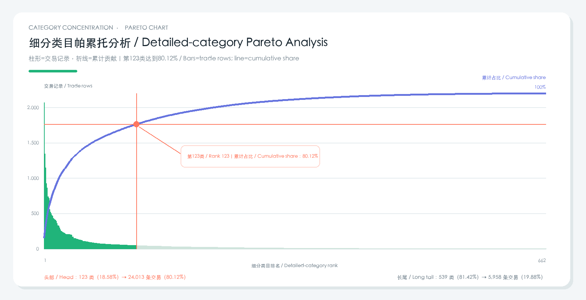
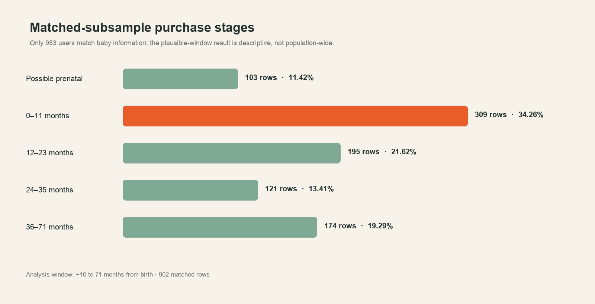

# 淘宝母婴商品交易与用户消费分析报告

# Taobao Maternal and Infant Transaction & Customer Analysis Report

## 1. 执行摘要 | Executive summary

本项目分析阿里云天池淘宝母婴购物数据，目标是识别交易规模变化、增长来源、品类
结构和有限的用户特征，并把数据质量对结论的影响明确呈现。核心交易表包含
29,971 条记录、29,944 名购买用户和 76,250 件商品，时间范围为 2012-07-02 至
2015-02-05。

This project analyzes the Alibaba Tianchi Taobao maternal and infant shopping
dataset to identify changes in transaction scale, growth drivers, category
structure, and the limited customer signals available. The core table contains
29,971 trade rows, 29,944 purchasing users, and 76,250 raw units from July 2,
2012 through February 5, 2015.

最重要的发现如下：

1. 2014 年交易记录和购买用户分别同比增长 54.04% 和 54.13%，增长主要来自
   更多购买用户，而不是购买频次提升。
2. 原始购买件数同比增长 85.16%，但 `<100` 口径购买件数仅增长 49.27%。单笔
   100 件及以上的记录贡献了总件数增量的 61.70%。
3. `cat1=50008168` 是覆盖最广、最稳定的一级品类；前三个一级品类贡献了
   2013→2014 年 81.28% 的交易记录增量。
4. 662 个细分类目中，排名前 123 个（18.58%）累计贡献 80.12% 的交易记录；
   其余 539 个（81.42%）贡献 19.88%，呈现接近二八分布的头部与长尾结构。
5. 跨日复购率仅 0.0802%；人口属性只覆盖 3.18% 的购买用户，因此不适合进行
   复杂 RFM、复购预测或总体人口属性推断。

Key findings:

1. Trade rows and purchasing users grew 54.04% and 54.13% in 2014, indicating
   user-base expansion rather than higher purchase frequency.
2. Raw units grew 85.16%, versus 49.27% under the `<100` sensitivity view.
   Rows of at least 100 units supplied 61.70% of the total unit increase.
3. `cat1=50008168` is the broadest and most stable top-level category; the top
   three categories contributed 81.28% of 2013–2014 trade-row growth.
4. The first 123 of 662 detailed categories (18.58%) cumulatively contribute
   80.12% of rows; the remaining 539 (81.42%) contribute 19.88%.
5. Cross-day repeat purchase is only 0.0802%, while demographics cover 3.18%
   of users, limiting RFM, repeat prediction, and population-level inference.

## 2. 项目背景与业务问题 | Background and business questions

母婴商品往往受到婴幼儿阶段、品类刚需和促销季节影响，但本数据缺少价格、收入、
渠道、商品名称和订单类型。分析因此聚焦数据能够回答的问题，而不把“购买件数”
直接等同于销售额或商业价值。

Maternal and infant purchases may vary by child stage, category necessity, and
promotion season. However, this dataset lacks price, revenue, channel, product
name, and order type. The analysis therefore stays within what the evidence can
support and does not treat units as revenue or commercial value.

本报告回答五个核心问题：

1. 数据质量是否足以支持分析？
2. 交易规模如何变化，增长是真实活动还是大数量记录造成？
3. 哪些一级和细分类目贡献主要交易与增长？
4. 用户是否存在可分析的复购和人口属性差异？
5. 结论能够支持哪些行动，哪些判断仍需补充数据？

The report asks whether the data is fit for analysis, how activity changed,
which categories drove growth, what customer signals exist, and which actions
the evidence can reasonably support.

## 3. 数据、模型与指标口径 | Data, model, and metric definitions

### 3.1 数据来源 | Source

- 数据集：[阿里云天池母婴购物数据集](https://tianchi.aliyun.com/dataset/45)
- 婴儿信息：953 行
- 交易历史：29,971 行
- 分析数据库：MySQL `mum_baby_analysis`
- 分析模型：`fact_trade` 与 `dim_baby`

Raw CSV files are not committed to GitHub. The public repository contains only
validated SQL, aggregated evidence, figures, and bilingual documentation.

### 3.2 核心指标 | Core metrics

| 指标 Metric | 定义 Definition | 用途 Use |
|---|---|---|
| 交易记录数 / Trade rows | `COUNT(*)` | 衡量交易活动规模 / Activity scale |
| 购买用户数 / Purchasing users | `COUNT(DISTINCT user_id)` | 衡量用户覆盖 / User reach |
| 原始购买件数 / Raw units | `SUM(buy_amount)` | 保留原始业务记录 / Raw recorded quantity |
| 购买件数（单条记录 `<100`）/ Units from rows `<100` | `SUM(CASE WHEN buy_amount < 100 THEN buy_amount ELSE 0 END)` | 判断结论是否被大数量记录改变 / Test high-quantity influence |
| 跨日复购用户 / Cross-day repeat user | 至少两个不同购买日期 / At least two purchase dates | 避免把同日多商品误判为复购 / Avoid same-day misclassification |

`100` 是敏感性分析阈值，不是异常值删除规则。缺乏订单类型和单位信息时，不能把
大数量记录直接判定为错误。

The threshold of 100 is a sensitivity boundary, not a deletion rule. Without
order type or unit definition, high-quantity rows cannot be labeled errors.

## 4. 数据质量评估 | Data-quality assessment

| 检查 Check | 结果 Result | 分析影响 Analytical implication |
|---|---:|---|
| CSV 与导入行数对账 / Import reconciliation | 完全一致 / Exact | 数据未在导入中丢失 / No import loss |
| 交易完全重复行 / Exact duplicate rows | 0 | 不需要删除重复交易 / No duplicate removal |
| `property` 缺失 | 144（0.48%） | 不影响核心 KPI / Does not block KPIs |
| `auction_id` 重复 | 1,122 组 | 不能作为事实表主键 / Not a fact-table key |
| 单笔 `buy_amount >= 100` | 65（0.2169%） | 贡献 39.99% 原始件数 / Contribute 39.99% of raw units |
| 人口属性用户覆盖 | 953（3.18%） | 只能作为补充样本 / Supplementary only |

高数量记录数量极少，但对总件数影响很大，因此后续所有涉及“件数”的结论均同时
展示原始与敏感性口径。

## 5. 整体交易规模 | Overall transaction scale

| 指标 Metric | 结果 Result |
|---|---:|
| 交易记录 / Trade rows | 29,971 |
| 购买用户 / Purchasing users | 29,944 |
| 不同交易标识 / Distinct auction IDs | 28,422 |
| 一级品类 / Top-level categories | 6 |
| 细分类目 / Detailed categories | 662 |
| 原始购买件数 / Raw units | 76,250 |
| 购买件数（单条记录 `<100`）/ Units from rows `<100` | 45,755 |

交易记录仅比购买用户多 27，人均交易记录为 1.0009。这一结构预示复购信号很弱，
后续用户级聚合也验证了这一判断。

Trade rows exceed purchasing users by only 27, producing 1.0009 rows per user
and foreshadowing the weak repeat-purchase signal confirmed later.

## 6. 时间趋势与增长拆解 | Time trends and growth decomposition

2012 年只有 6 个完整或部分月份，2015 年止于 2 月 5 日，因此年度同比只比较完整
的 2013 和 2014 年。

*图1：2014年交易活动指标与件数指标同比。原始件数增速明显偏离交易记录、用户和
`<100`口径购买件数。 / Figure 1. Raw-unit growth diverges from activity and
the `<100`-per-row view.*

2014 年交易记录与用户增长基本一致，说明增长主要由用户规模扩大推动。原始件数
增速比敏感性口径高 35.89 个百分点；高数量件数同比增长 155.43%，并贡献总件数
增量的 61.70%。

### 6.1 2014年11月高峰 | November 2014 peak

*图2：2014年月度原始件数与购买件数（单条记录 `<100`）。 / Figure 2.
Monthly raw units and units from rows below 100 in 2014.*

2014 年 11 月有 1,833 条交易记录和 2,460 件 `<100` 口径购买件数，两项均为样本期
最高，说明当月确有真实活动高峰。但原始 13,044 件中，仅一条 10,000 件记录就
占 76.66%；当月 6 条高数量记录合计贡献 81.14% 的原始件数。

The November activity peak is real, but its raw-unit magnitude is not typical.
The dashboard and report should therefore lead with trade rows and sensitivity
units, while retaining raw units as an auditable secondary view.

## 7. 一级品类表现与增长来源 | Top-level category performance

*图3：一级品类份额矩阵。每一行固定代表一个 `cat1`，四列依次展示交易记录占比、
原始件数占比、`<100` 口径件数占比和品类内部高数量件数占比，所有条形采用统一的
0–60%刻度。 / Figure 3. Top-level category share matrix using a shared 0–60%
scale across four directly labeled measures.*

绿色重点行标出交易覆盖最广的核心品类 `50008168`；橙色重点行标出原始件数受
高数量记录影响最明显的 `28` 和 `50014815`。其余三个品类使用水平分隔线保留
完整比较背景，但不与核心发现争夺视觉注意力。

The green focus row marks the core activity leader, while orange focus rows
mark the two categories most affected by high quantities. Neutral separator
lines keep the remaining categories easy to follow without competing with the
main findings.

`50008168` 贡献 41.69% 的交易记录和 32.37% 的 `<100` 口径购买件数，是覆盖最广、表现
最稳定的一级品类。`28` 和 `50014815` 的高数量件数分别占自身原始件数的
52.15% 和 56.81%，仅用原始件数排序会改变对品类表现的判断。

2013→2014 年：

| `cat1` | 交易行增量 Row increase | 自身增速 Growth | 整体增长贡献 Contribution |
|---:|---:|---:|---:|
| 50008168 | 2,073 | 50.61% | 39.33% |
| 28 | 1,285 | 57.52% | 24.38% |
| 50014815 | 926 | 60.13% | 17.57% |
| 50022520 | 481 | 64.56% | 9.13% |
| 122650008 | 398 | 57.35% | 7.55% |
| 38 | 108 | 24.32% | 2.05% |

前三个品类合计贡献 81.28% 的交易增长。`50022520` 自身增速最高，但绝对增量
只有 481 条，说明“增长率最高”与“对整体增长贡献最大”不是同一概念。

## 8. 细分类目集中度与二八结构 | Detailed-category concentration and Pareto structure

*图4：按交易记录降序排列的细分类目累计贡献曲线。 / Figure 4. Cumulative
trade-row contribution after ranking detailed categories.*

这里的“二”和“八”被明确划分为：

| 分组 Segment | 品类数 Categories | 品类占比 Category share | 交易记录 Rows | 交易占比 Row share |
|---|---:|---:|---:|---:|
| 头部组：“二” / Head group (“20”) | 123 | 18.58% | 24,013 | 80.12% |
| 长尾组：“八” / Long tail (“80”) | 539 | 81.42% | 5,958 | 19.88% |
| 合计 / Total | 662 | 100% | 29,971 | 100% |

因此，该数据接近二八分布，但不能简化成“Top 10 就代表全部头部”：Top 10 只占
31.29% 的交易记录，达到 80% 需要 123 个品类。业务上应同时管理头部组合和
长尾效率，而不是只关注少数爆款。

The pattern is Pareto-like, but the head is broader than a Top-10 list. It takes
123 categories to reach 80%, so the portfolio combines a concentrated head
with a meaningful long tail.

### 8.1 头部组前20名 | First 20 categories within the head group

| 排名 Rank | `cat1` | `cat_id` | 交易记录 Rows | 单项占比 Share | 累计占比 Cumulative |
|---:|---:|---:|---:|---:|---:|
| 1 | 50008168 | 50013636 | 2,066 | 6.89% | 6.89% |
| 2 | 50008168 | 50010558 | 1,341 | 4.47% | 11.37% |
| 3 | 50008168 | 50013207 | 1,148 | 3.83% | 15.20% |
| 4 | 50008168 | 50006602 | 924 | 3.08% | 18.28% |
| 5 | 28 | 50011993 | 864 | 2.88% | 21.16% |
| 6 | 50008168 | 50012451 | 739 | 2.47% | 23.63% |
| 7 | 50014815 | 50018831 | 718 | 2.40% | 26.03% |
| 8 | 122650008 | 50012359 | 554 | 1.85% | 27.87% |
| 9 | 50008168 | 50010555 | 522 | 1.74% | 29.62% |
| 10 | 38 | 211122 | 502 | 1.67% | 31.29% |
| 11 | 50022520 | 50023591 | 476 | 1.59% | 32.88% |
| 12 | 50008168 | 50010566 | 464 | 1.55% | 34.43% |
| 13 | 50008168 | 50013711 | 431 | 1.44% | 35.86% |
| 14 | 50008168 | 50010549 | 420 | 1.40% | 37.27% |
| 15 | 50008168 | 50010557 | 413 | 1.38% | 38.64% |
| 16 | 28 | 50003700 | 407 | 1.36% | 40.00% |
| 17 | 122650008 | 50012365 | 390 | 1.30% | 41.30% |
| 18 | 50008168 | 50007011 | 361 | 1.20% | 42.51% |
| 19 | 50008168 | 50010544 | 331 | 1.10% | 43.61% |
| 20 | 50008168 | 50012442 | 321 | 1.07% | 44.68% |

全部 662 个品类的排名、累计占比和头部/长尾标签见
[`data/pareto_category_segments.csv`](../data/pareto_category_segments.csv)。这让
报告中的“二”和“八”可以逐项追溯，而不是只展示一个概念图。

## 9. 用户购买频次与复购 | Purchase frequency and repeat purchase

| 指标 Metric | 结果 Result |
|---|---:|
| 购买用户 / Purchasing users | 29,944 |
| 单条记录用户 / Single-row users | 29,919 |
| 多条记录用户 / Multi-row users | 25 |
| 跨日复购用户 / Cross-day repeat users | 24 |
| 跨日复购率 / Cross-day repeat rate | 0.0802% |

超过 99.9% 的用户只有一条记录。唯一一个“多行但单日”的用户在同一天购买两个
不同商品，未计为跨日复购。该结构不支持复杂 RFM 或复购预测；任何留存策略都应
在获得更完整的纵向行为数据后重新验证。

More than 99.9% of users have one row. The dataset supports acquisition-scale
and category analysis, but not robust lifecycle or retention modeling.

## 10. 人口属性补充分析 | Demographic supplement

*图5：合理日期窗口内的匹配子样本购买阶段。 / Figure 5. Purchase stages in
the plausible matched-subsample window.*

婴儿信息只覆盖 953 名用户和 956 条交易。交易相对出生日期的月份差从 -25 到
339；其中 54 条（5.65%）位于设定的主要解释范围之外。主要阶段分析使用 `-10`
至 `71` 个月的 902 条记录：0–11个月占 34.26%，为最大阶段；12–23个月敏感性
平均件数最高，为每条 1.70 件。

男婴、女婴和未知性别分别占匹配用户的 51.31%、45.96% 和 2.73%。男女组前三个
一级品类相同，整体品类构成相似。由于覆盖低且字段由用户填写，本节仅作为补充
描述，不能推广到全部购买用户。

## 11. 业务建议 | Recommendations

### 11.1 指标治理 | Metric governance

- 看板主要使用交易记录、购买用户和购买件数（单条记录 `<100`）；原始件数作为
  可追溯对照。
- 对单笔 100 件及以上记录建立审核标签，补充订单类型、计量单位和采购身份后再
  决定是否属于批量采购或数据异常。
- 不把购买件数表述为销售额、收入或利润。

Use activity and sensitivity metrics as the primary performance view, retain
raw units for auditability, and investigate high-quantity rows before making
commercial claims.

### 11.2 品类管理 | Category management

- 优先监测 `50008168` 及前三个增长贡献品类，它们共同推动 81.28% 的交易增长。
- 将前 123 个细分类目定义为头部运营池，同时保留长尾组的效率监测。
- 数据缺少品类名称和利润信息，获得映射表后再制定具体选品、库存或营销方案。

### 11.3 用户分析 | Customer analysis

- 当前数据适合监测新购买用户规模，不适合把 0.0802% 直接解释为真实平台复购率。
- 后续应补充连续用户行为、订单金额、渠道、活动标识和更长观察窗口，再开展 RFM、
  留存和复购预测。

## 12. 分析限制 | Limitations

1. 2012 和 2015 是不完整年度，年度同比仅比较 2013 与 2014。
2. `buy_amount` 缺少单位和订单类型，高数量记录无法定性。
3. 数据缺少价格，不能计算 GMV、客单价、收入或利润。
4. 数据缺少品类名称映射，不能将匿名编码推测为具体商品。
5. 用户几乎一人一行，不适合生命周期建模。
6. 人口属性覆盖率低且存在极端出生日期，不具总体代表性。
7. 所有发现描述该样本，不直接代表淘宝或母婴行业总体。

## 13. 可复现性 | Reproducibility

| 模块 Module | 成品 SQL Final SQL |
|---|---|
| 数据库与暂存表 / Setup | [`01_setup.sql`](../sql/01_setup.sql) |
| 清洗与分析模型 / Model | [`02_model.sql`](../sql/02_model.sql) |
| 整体 KPI / Overview | [`03_overview_kpis.sql`](../sql/03_overview_kpis.sql) |
| 复购与频次 / Frequency | [`04_customer_frequency.sql`](../sql/04_customer_frequency.sql) |
| 时间趋势 / Time trends | [`05_time_trends.sql`](../sql/05_time_trends.sql) |
| 品类分析 / Categories | [`06_category_analysis.sql`](../sql/06_category_analysis.sql) |
| 人口属性 / Demographics | [`07_demographic_supplement.sql`](../sql/07_demographic_supplement.sql) |

报告中的每个核心结论均可追溯到成品 SQL、聚合结果或明确的数据质量检查。后续网页
应以本报告为内容和证据基线，只改变交互方式，不改变指标定义。

Every material finding traces to validated SQL, aggregated evidence, or an
explicit quality check. The future website should use this report as its content
contract: interaction may change presentation, but not definitions or evidence.
